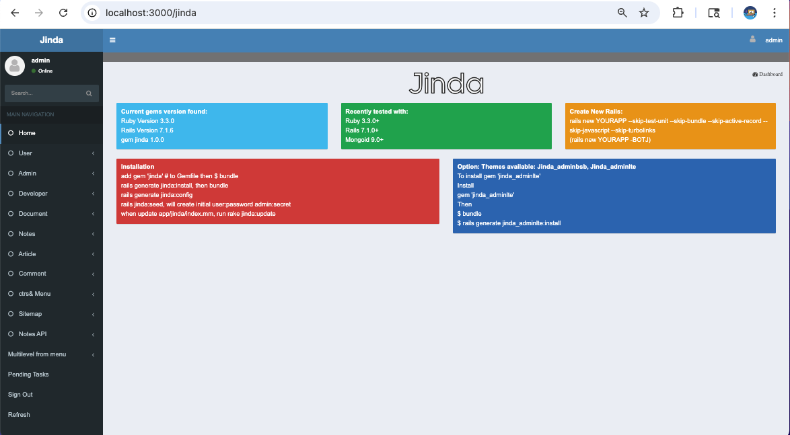
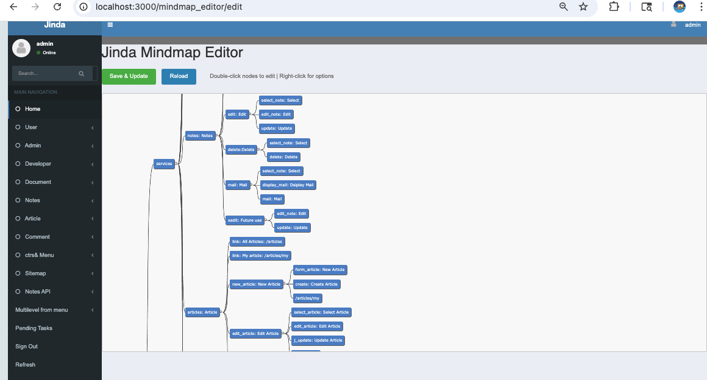
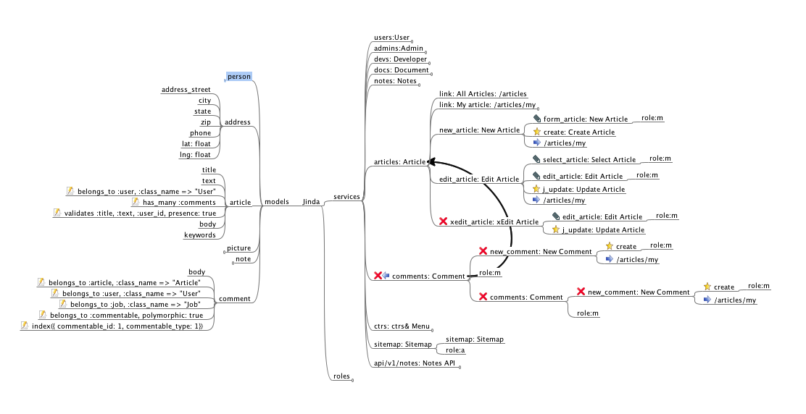
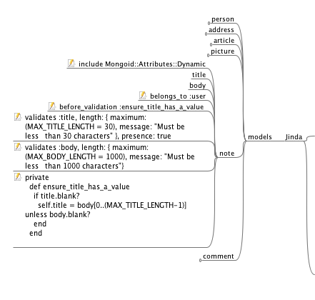
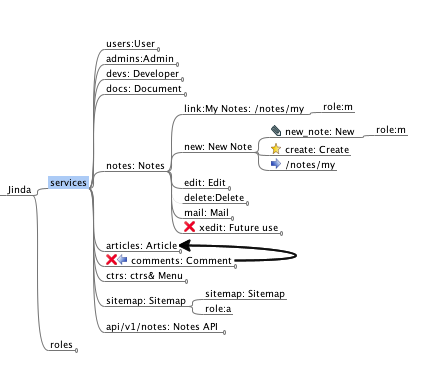

# Jinda

Jinda is a gem to create Rails Workflow & Application Generator using Freemind and coming with AI

Jinda is a tools for Ruby on Rails developer. (Required: basic Ruby on Rails )

## Jinda use the following technologies:

- JQuery Mobile and Bootstrap as Javascript front-end development framework
- Rails Engine as Jinda core for router, helper
- Workflow using Freemind design as XML to control Rails flow.
- User authentication for login and role for each activity
- Support Social authentication: Facebook, Google
- Polymorphic Association in mongodb
- Dynamic role for user and group
- Rails concern & mixins for rails modules and class
- Sample app: Articles, API Note, Document
- Support themes: Jinda_adminlte, Jinda_adminBSB
- Support HTML, HAML, SCSS
- AI
  <br />

# [Jinda](https://github.com/kul1/jinda)






## Additional Extension themes also available at

- [jinda_adminlte](https://github.com/kul1/jinda_adminlte)

  - 

- [jinda_adminbsb](https://github.com/kul1/jinda_adminbsb)
  - 

## Prerequisites

**Jinda 0.8.0+ is compatible with Ruby 3.1+ and Rails 7.0+**

These versions works for sure but others may do.

- Ruby 3.1.2
- Rails 7.0.0
- MongoDB 6
- Freemind 1.0.1

## Note for Mac M1

- Once finish configure: Ruby and Rails version
- Need Pre-install Nokogiri as follow:

```
 
arch -x86_64 gem install nokogiri -v '1.10.10' --platform=ruby -- --use-system-libraries
 
 
```

## Note for Rails 7

- depend on  mongoid dependencies: activemodel need to satify with Rails 7

## Convention

- database is MongoDB
- images stored in upload directory, unset IMAGE_LOCATION in `initializer/jinda.rb` to use Cloudinary
- mail use Gmail SMTP, config in `config/application.rb`
- authentication use omniauth-identity

## Sample Application

### Screen shot install Jinda

[Watch install video on YouTube](https://www.youtube.com/watch?v=XUXv7Yrskjk)

### Sample Jinda in Docker

- https://github.com/kul1/jinda-docker

Supposed we want to create ecommerce web site, first create a Rails
app without ActiveRecord

    $ rails _7.0.0_ new YOURAPP -BOTJ

## Add jinda to your Gemfile:
 ```
     gem 'jinda'
  ```
For Development (most updated)
 ```
     gem 'jinda', github:'kul1/jinda'
  ```
depend on your operating system, you may need to uncomment
 ```
     gem 'therubyracer', :platforms => :ruby
  ```
install gems
 ```
     $ bundle install
  ```
generate jinda application
 ```
     $ rails generate jinda:install
  ```
Then run bundle again to install additional gems added by jinda
 ```
     $ bundle install
  ```
configure mongoid, omniauth
 ```
     $ rails generate jinda:config
  ```
     Please make sure mongod is running then create admin user
 ```
     $ rails jinda:seed
  ```
     # Option: to use jinda_adminlte theme require add Gemfile with:
 ```
        gem 'jinda_adminlte'
  ```   
     Then
 ```
        $ rails g jinda_adminlte:install
  ```
now the application is ready, start it as any Rails application
Please include your .env for social login, here sample 
 ```
GOOGLE_CLIENT_ID=

GOOGLE_CLIENT_SECRET=
 ```
 ```
  $ rails server
  ```
go to http://localhost:3000, click _Sign In_ on the left menu, and enter user name `admin` and password `secret`


Now open file `app/jinda/index.mm` using Freemind


The 3 main branches are

- models - this defines all the models to use in the application
- services - this defines services which will be come the menu on the left of the screen. There will be 2 levels; the first sub branch is the main menu (modules) and the second sub branch is the sub menu (services)
- roles - this defines role for all users

### models

Fiirst, we need to create some product so we click on models we'll see 2 models person and address. These are sample only. You can delete them or modify them however you want. We'll take a look at them first


The first sub branch (e.g. person) is the model name. According to Rails convention, this should be a singular word. The next sub branch are columns in the database. Let's take a look at each:

- `fname` - this create a column (field) called fname which is a String by default
- `sex: integer` - this create a column called sex, it is integer so must be explicity defined. The next sub branch (1: male) is disregarded by Jinda so we can put whatever we want. Here I just put some reminder.
- `belongs_to :address` - here we have 
  icon. this means whatever text on this line will be added as is to the model Jinda generates. You use this to specify anything you want such as association, index, remarks in code, etc. according to mongoid gem. To draw the icon, rest mouse on the branch and hit &ltAlt-I&gt;.
- `dob: date` - use any type that mongoid provides.
- `photo` - for file field, just use String here. Jinda will receive the binary file and store in file system or cloudinary then generate a url link to it.

In this example we just want a product model, so delete the person and address model and add a product branch like so


Save the mind map then run:

    rake jinda:update

This will create file `app/models/product.rb`. In this file, note the comment lines `# jinda begin` and ` # jinda end`. Everything inside these comments will get overwritten when you change the models branch in the mind map so if you need to put anything inside here, use the mind map instead. You can add anything outside these comment lines which will be preserved when doing jinda:update.

### services

Next we'll add some product into the database, we'll first take a look at the services branch, which already has 3 sub branches; users, admins, and devs. Unlike models person and address branches, these branches are actively used by the system so I recommend that you leave them alone. Let's open the users branch


The text `users:User` on the sub branch has these implications:

- `users` correspond to `app/controllers/users_controller.rb` which already exist when you do rails generate jinda:install. New branch will create new controller if not exist. In Jinda term, this will be called module.
- `User` will create entry in main menu on the left of the screen. You don't see it in the screenshot above because it's controlled by the sub branch `role:m` which means this menu only available for login member. If you already signed in as admin, you should see it now.

The next sub branches has the following:

- `role: m` - means that this module (menu) is available only to user who has role m (if you open the role branch now will see that role m is member). All registered user has role m by default. User who is not log on would not be able to access this module.
- `link:info: /users` - means that this is a link, the format is link: _submenu label_ : _url_ where submenu label is the text to show in the submenu and url is the link to go to, in this case, it woud go to http://localhost:3000/users which will perform index action of UsersController.
- `user:edit` the branch that do not start with role:, rule:, nor link: will be a Jinda service. You will then specify the sequence of the execution as in this example there are 3 sub branches - enter_user, update_user, and rule:login? Let's take a look at them:

- `enter_user:edit` - the first step is to display a form to input user information, this is accompanied by icon 
  which means user interface screen. and will correspond to a view file `app/views/users/user/enter_user.html.erb` where `/users` comes from the module name (the sub branch of services), `/user` comes from the service name (the sub branch of users), and `enter_user.html.erb` comes from the first part of this branch. The `edit` after the colon is just a description of this step. This branch also has sub branch `rule:login? && own_xmain?` which specify rule for this step that the user must be login and can continue this task if he is the one who started it. _task_ in here means each instance of service.
- `update_user` - this icon  means to execute method update_user within `users_controller.rb`

Armed with this knowledge, we are ready to add new product into our application like so:


To generate controller and views we save this mind map and run

    rake jinda:update

open file `app/views/products/add/enter.html.erb` you'll see some sample view already in there but commented. edit the file so it look like this


Note that we do not specify form_tag and submit_tag, these will be supplied by Jinda.

then open file `app/controllers/products_controller.rb` and add `create` method as follow. The method name has to be correspond to the bookmark branch.


## Testing

run following command:

    rails generate jinda:rspec
    guard init
    guard


## Contributing

1. Fork it
2. Create your feature branch (`git checkout -b my-new-feature`)
3. Commit your changes (`git commit -am 'Add some feature'`)
4. Push to the branch (`git push origin my-new-feature`)
5. Create new Pull Request

## Quick Test Run

For developers, this section provides a streamlined way to clone, install, and test a Jinda-powered Rails app. It validates the gem's functionality and auto-starts a sample application for immediate exploration.

### Prerequisites
- Ensure MongoDB is running on the default port 27017. If not installed or running, use Docker for quick setup:
  ```
  docker run -d -p 27017:27017 --name mongodb_test mongo:latest
  ```
  (Stop with `docker stop mongodb_test` when done.)

### Steps
1. **Clone the Repository**: Download the Jinda gem source to your development directory (e.g., `~/mygem`):
   ```
   git clone https://github.com/kul1/jinda.git ~/mygem/jinda
   ```

2. **Navigate to the Directory**:
   ```
   cd ~/mygem/jinda
   ```

3. **Run the Test Script**: Execute the automated installer and server starter:
   ```
   bash test_run.sh
   ```
   - This creates a new Rails app (`jinda_test_app_XXXX`), installs Jinda, seeds the database (admin/secret user), and auto-starts the server on the first available port (starting from 3000, e.g., http://localhost:3000).
   - Access the app in your browser, sign in with username `admin` and password `secret`, and explore the menu (e.g., Notes, Articles, Admin > Mindmap Editor).
   - Press Ctrl+C to stop the server and return to the original directory (app preserved for reuse).

For a cleanup-only run (tests without preserving the app): `bash test_run.sh -C`.

This quick test confirms Jinda's installation and generates a functional app based on the default mindmap. Proceed to the guide below for customization.

## Jinda Gem - Quick Start Guide: Building a Notes, Articles, or Documents App

Jinda generates complete Rails applications from a Freemind mindmap file (`app/jinda/index.mm`). All generated code (models, controllers, views, etc.) originates from templates in the Jinda gem at `$HOME/mygem/jinda/lib/generators/jinda/templates/app`. During `rails generate jinda:install` and `rake jinda:update`, these templates are copied and populated based on your mindmap. Code between `# jinda begin` and `# jinda end` in generated files is overwritten on updates; add custom code outside these markers to preserve it.

This guide focuses on using the default mindmap to manage Notes, Articles, or Documents. The default `index.mm` (generated from the gem template) includes ready-to-use branches for these. Edit `app/jinda/index.mm` in Freemind, save, then run `rake jinda:update` to regenerate code.



The mindmap has three main branches:
- **models**: Defines MongoDB models (via Mongoid).
- **services**: Defines left-side menu modules (main menu) and services (sub-menu workflows).
- **roles**: Defines user roles (e.g., admin, member). Defaults suffice; leave intact unless customizing.

### Models: Defining Your Data Structure

The default **models** branch includes samples like `person`, `address`, `article`, `note`, `picture`, and `comment`. For a Notes app, use/modify `note`; for Articles, use `article`; for Documents, adapt `picture` or add `document`.

Under a model (singular, Rails convention), sub-branches define fields:
- Plain text (e.g., `title`): Default String field.
- With type (e.g., `body: text`): Mongoid type (string, integer, date, boolean, array, etc.).
- Raw code (e.g., `belongs_to :user`): Right-click branch > Insert > Icon > pen (edit icon) to add Mongoid associations, validations, indexes, etc.
- File uploads (e.g., `file`): Use String; Jinda handles storage (filesystem/Cloudinary) and URL generation.

**Example: Default `note` model (for Notes app):**

```
models
└── note
    ├── include Mongoid::Attributes::Dynamic (pen icon: enables dynamic fields)
    ├── title (String)
    ├── body (text)
    ├── belongs_to :user (pen icon: association)
    ├── before_validation :ensure_title_has_a_value (pen icon: callback)
    ├── validates :title, length: { maximum: 30 }, presence: true (pen icon: validation)
    └── private def ensure_title_has_a_value ... end (pen icon: method)
```



Save and run `rake jinda:update`. This updates `app/models/note.rb` (generated from gem template `lib/generators/jinda/templates/app/models/note.rb`):

```ruby
# jinda begin
class Note
  include Mongoid::Document
  include Mongoid::Attributes::Dynamic
  field :title, type: String
  field :body, type: String
  belongs_to :user
  before_validation :ensure_title_has_a_value
  validates :title, presence: true, length: { maximum: 30 }
  # ... private method ...
  # jinda end
end
```

For Articles (`article` model): Fields like `title`, `text`, `body`, with `belongs_to :user` and `has_many :comments`.

For Documents: Modify `picture` (fields: `picture`, `description`, `belongs_to :user`) or add `document` with `title`, `file: string`, `belongs_to :user`.

Add custom code (e.g., scopes) outside markers.

### Services: Building Menus and Workflows

Defaults include `users`, `admins`, `devs` (leave intact for auth/admin). Ready services: `notes: Notes` (for Notes), `articles: Article` (for Articles), `docs: Document` (for Documents).

Each module (first sub-branch, e.g., `notes: Notes`) creates:
- Controller (`app/controllers/notes_controller.rb`, from template).
- Main menu item ("Notes").

Sub-branches define access/steps:
- `role: m`: Restricts to 'm' (member role).
- `link:label:/path`: Simple link (e.g., `link:My Notes:/notes/my` → submenu linking to user notes).
- Service branches: Multi-step workflows.
  - Screen icon (UI): View form (e.g., `new_note: New` → `app/views/notes/new/new_note.html.erb`, from template).
    - Sub-branch rules: e.g., `role: m` or `rule: login? && own_note?`.
  - Bookmark icon: Controller method (e.g., `create` → `def create`).
  - Forward icon: Redirect (e.g., to `/notes/my`).

**Example: Default `notes: Notes` service (for creating/editing notes):**

```
services
└── notes: Notes (module: menu "Notes")
    ├── link:My Notes:/notes/my (role: m)
    └── new: New Note (service)
        ├── new_note: New (screen icon, role: m)
        ├── create: Create (bookmark icon)
        └── /notes/my (forward icon: redirect)
    ├── edit: Edit (service)
        ├── select_note: Select (screen, role: m)
        ├── edit_note: Edit (screen, role: m)
        └── update: Update (bookmark)
    ├── delete: Delete (service, fork style)
        ├── select_note: Select (screen, role: m)
        └── delete: Delete (bookmark)
    └── ... (mail, xedit)
```



**Example: Add an "articles" module (default `articles: Article` service, for creating/editing articles with comments):**

```
services
└── articles: Article (module: menu "Articles")
    ├── link:All Articles:/articles
    ├── link:My article:/articles/my (role: m)
    └── new_article: New Article (service)
        ├── form_article: New Article (screen icon, role: m)
        ├── create: Create Article (bookmark icon)
        └── /articles/my (forward icon: redirect)
    ├── edit_article: Edit Article (service)
        ├── select_article: Select Article (screen, role: m)
        ├── edit_article: Edit Article (screen, role: m)
        └── j_update: Update Article (bookmark)
    ├── xedit_article: xEdit Article (hidden service)
        ├── edit_article: Edit Article (screen, role: m)
        └── j_update: Update Article (bookmark)
    └── comments: Comment (service, linked to articles)
        ├── new_comment: New Comment (role: m)
        │   └── create (bookmark)
        └── /articles/my (forward icon: redirect)
```


Save and run `rake jinda:update`. Generates/updates:
- `app/controllers/notes_controller.rb` (skeleton from template; add custom logic outside markers).
- Views like `app/views/notes/new/new_note.html.erb` (basic form from template; uncomment/edit fields):

```erb
<!-- app/views/notes/new/new_note.html.erb -->
<h1>New Note</h1>

<%= f.text_field :title, placeholder: "Note Title" %>
<%= f.text_area :body, placeholder: "Note Body", rows: 10 %>

<!-- Jinda provides form_tag, submit -->
```

In controller, implement methods (e.g., `create` outside markers):

```ruby
# app/controllers/notes_controller.rb

class NotesController < ApplicationController
  # jinda begin
  # ... generated skeleton ...
  # jinda end

  def create
    @note = Note.new(note_params)
    @note.user = current_user
    if @note.save
      redirect_to notes_my_path, notice: "Note created!"
    else
      render :new_note
    end
  end

  private

  def note_params
    params.require(:note).permit(:title, :body)
  end
end
```

Similar for `articles: Article` (create/edit with comments) and `docs: Document` (new/edit with file upload).

For full CRUD: Defaults include list (`/notes/my`), edit, delete. Add steps like `show_note: Show` (screen icon) for views.

Test: `rails s`, login (admin/secret), navigate to "Notes" > "new".

### Roles: User Permissions

Defaults: `m: member` (basic), `a: admin` (full), `d: developer`. Reference in services (e.g., `role: m`). Add roles like `editor: Editor` if needed.

### Next Steps

- Seed: `rails jinda:seed`.
- MongoDB: `docker run -d -p 27017:27017 mongo`.
- Customize: Edit mindmap (e.g., add fields to `note`), run `rake jinda:update`.
- Themes: `gem 'jinda_adminlte'; bundle install; rails g jinda_adminlte:install`.
- API: Defaults include `api/v1/notes` for RESTful endpoints.
- Advanced: Multi-step rules, polymorphic comments (already in `comment` model).

Iterate: Modify mindmap, update, test login/menu at `localhost:3000`. For new apps, extend defaults for your Notes/Articles/Documents workflow.